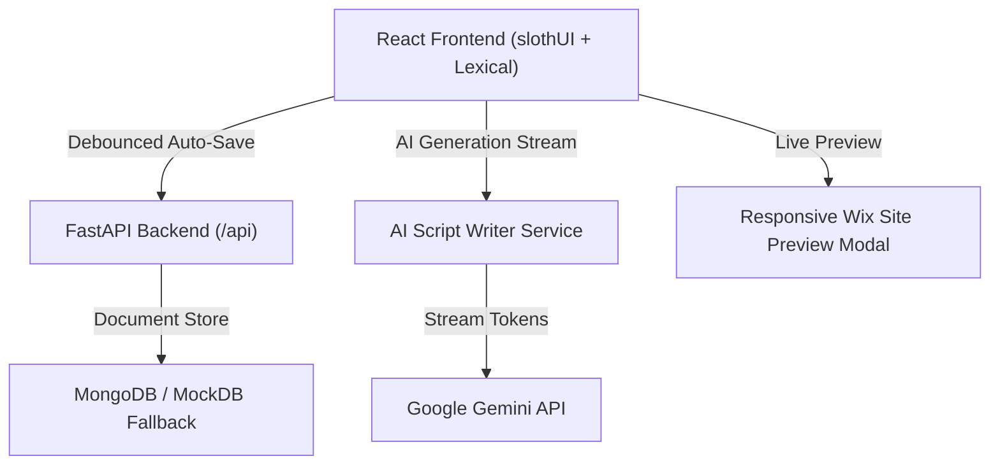

<div align="center">

# 🚀 Smart Blog Studio — AI-Powered Editor & SaaS Dashboard

[](https://vercel.com/new/clone?repository-url=https%3A%2F%2Fgithub.com%2FJayaveer08%2FSmart-Blog-editor)
[](https://reactjs.org/)
[](https://fastapi.tiangolo.com/)
[](https://tailwindcss.com/)
[](https://ai.google.dev/)

An enterprise-grade, high-performance **Wix-inspired Smart Blog Editor & Publishing Studio** built with **React**, **slothUI**, **Lexical WYSIWYG Framework**, and **FastAPI**. Includes real-time **AI Script Writer assistant**, contextual selection bubble menus, debounced autosave, and live responsive Wix site previewing.

[🌐 Live Demo (Vercel)](https://smart-blog-editor-eight.vercel.app) • [📖 Architecture Diagram](#-system-architecture) • [⚡ Quick Start](#-getting-started)

</div>

---

## ✨ Features at a Glance

### 📱 1. slothUI Rich WYSIWYG Editor
- **Advanced Formatting Toolbar**: Headings (H1/H2/H3), Bold, Italic, Underline, Strikethrough, Blockquotes, Lists (Bullet/Numbered), and Monospace Code Blocks.
- **Word & Character Counters**: Dynamic reading time estimator and character counter.
- **Debounced Auto-Save**: Background autosaving with status indicators (`Saving...`, `Saved`).

### 🤖 2. AI Script Writer Assistant (`AIAssistant.jsx`)
- **Side Drawer Experience**: Smooth slide-over side panel for AI content generation.
- **Preset Prompt Engineering**:
  - 📝 **Blog Outline Generator**: Structures posts with H2/H3 section breakdowns.
  - 🚀 **5 Catchy Headlines**: Generates click-worthy titles tailored for maximum engagement.
  - 🔍 **SEO Metadata Creator**: Auto-generates meta titles, meta descriptions, and tags.
- **Tone Converter**: Rewrite content in *Professional*, *Casual*, or *Punchy* tones.
- **Streaming Tokens**: Direct streaming response rendering token-by-token into the active document.

### ⚡ 3. Contextual Selection Bubble Menu (`BubbleMenu.jsx`)
- **Floating Inline Toolbar**: Appears floating directly above highlighted text in the editor canvas.
- **Quick AI Actions**:
  - 🛡️ **Fix Grammar**: Auto-corrects syntax and spelling.
  - 🪄 **Expand Text**: Elongates paragraphs with rich contextual details.
  - ⚡ **Make Punchy**: Condenses long-winded sentences into impactful copy.
  - ✨ **Summarize**: Generates concise TL;DR bullet points.

### 🎨 4. Wix-Style Blog Studio & Dashboard (`Sidebar.jsx`, `Layout.jsx`)
- **Status Filter Tabs**: Filter post drafts by **All**, **Drafts**, or **Published**.
- **Instant Search**: Real-time keyword filtering across saved post titles.
- **Onboarding Templates**: Quick-start starter templates for rapid post drafting.

### 🖥️ 5. Live Wix Site Preview Modal (`LivePreviewModal.jsx`)
- **Dual Device Mockups**: Preview posts in **Desktop (1024px)** and **Mobile (375px)** device viewports before publishing.
- **Responsive Layout**: Renders styled blog typography matching live web production sites.

### 🛡️ 6. Resilient Backend & Monorepo Serverless Engine
- **MockDB Fallback**: In-memory database layer ensuring 100% backend uptime if MongoDB is unavailable.
- **Frictionless Auth**: Automatic guest user creation & JWT authentication.
- **Vercel Serverless Integration**: Monorepo routing mapping `/api/*` to FastAPI serverless handlers (`api/index.py`).

---

## 🏗️ System Architecture



---

## ⚡ Getting Started

### Prerequisites
- Node.js 18+
- Python 3.10+
- (Optional) MongoDB Atlas & Gemini API Key

### 1. Clone the Repository
```bash
git clone https://github.com/Jayaveer08/Smart-Blog-editor.git
cd Smart-Blog-editor
```

### 2. Backend Setup
```bash
cd backend
python -m venv .venv
# On Windows:
.\.venv\Scripts\activate
# On macOS/Linux:
source .venv/bin/activate

pip install -r requirements.txt
python -m uvicorn app.main:app --reload --port 8000
```
Backend API will run at `http://127.0.0.1:8000` (Swagger UI at `http://127.0.0.1:8000/docs`).

### 3. Frontend Setup
```bash
cd ../frontend
npm install
npm run dev
```
Open `http://localhost:5173` in your browser.

---

## 🌐 Deploying to Vercel

1. Fork or import `https://github.com/Jayaveer08/Smart-Blog-editor` into [Vercel](https://vercel.com/new).
2. Configure **Environment Variables** in Vercel settings:
   - `GEMINI_API_KEY`: Your Gemini API Key
   - `MONGO_URL`: MongoDB Connection URI *(optional, defaults to MockDB)*
   - `JWT_SECRET`: `supersecretkey`
3. Click **Deploy**. Vercel will automatically build the frontend static output and mount FastAPI serverless endpoints at `/api/*`.

---

## 📄 License

Distributed under the MIT License. See `LICENSE` for details.
