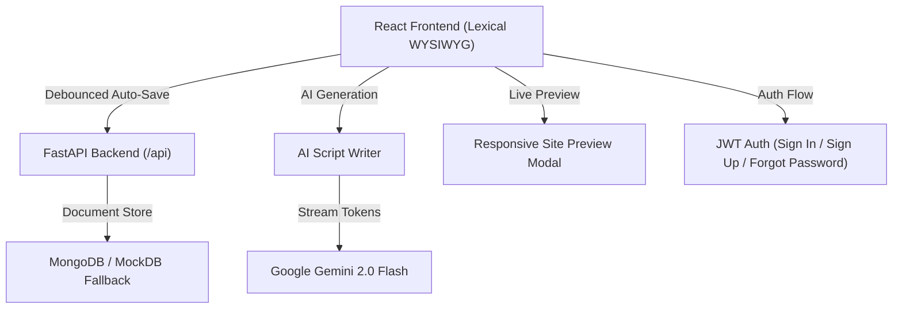

<div align="center">

# ✏️ Smart Blog Editor — AI-Powered Blog Editor & Publisher

[](https://vercel.com/new/clone?repository-url=https%3A%2F%2Fgithub.com%2FJayaveer08%2FSmart-Blog-editor)
[](https://reactjs.org/)
[](https://fastapi.tiangolo.com/)
[](https://tailwindcss.com/)
[](https://ai.google.dev/)

A premium, full-stack **AI Blog Editor & Publisher** built with **React**, **Lexical WYSIWYG**, and **FastAPI**. Comes with a real-time **AI Script Writer**, contextual bubble menus, debounced auto-save, live site preview, and a complete Sign In / Sign Up / Forgot Password authentication flow.

[🌐 Live Demo](https://smart-blog-editor-eight.vercel.app) • [📖 Architecture](#-system-architecture) • [⚡ Quick Start](#-getting-started)

</div>

---

## ✨ Features

### 📝 1. Rich WYSIWYG Editor
- **Advanced Toolbar**: Headings (H1–H3), Bold, Italic, Underline, Strikethrough, Code, Blockquotes, Bullet & Numbered Lists.
- **Floating Bubble Menu**: Select any text to get instant AI actions — Fix Grammar, Expand, Make Punchy, Summarize.
- **Debounced Auto-Save**: Background saving with `Saving...` / `Saved` status indicators.

### 🤖 2. AI Script Writer (Side Drawer)
- **Quick Generator Presets**: Blog Outline, Expand Text, Fix & Polish, 5 Catchy Titles, SEO Metadata.
- **Custom Prompts**: Type any instruction and the AI generates content directly.
- **Writing Tone Controls**: Professional, Casual, or Punchy tone rewrites.
- **Insert into Editor**: One-click button to append AI output directly into the blog canvas.
- **Gemini 2.0 Flash**: Direct streaming tokens via Google Gemini API with a resilient fallback generator.

### 🔐 3. Full Authentication
- **Sign In** — with show/hide password toggle and Forgot Password link.
- **Sign Up** — full registration with name, email, and password confirmation.
- **Forgot Password** — email form with success confirmation.
- **Auto-Logout** — JWT expiry redirects users to login automatically.

### 📋 4. Blog Dashboard
- **Status Filter Tabs**: View All, Drafts, or Published posts.
- **Instant Search**: Real-time keyword search across post titles.
- **User Avatar Dropdown**: Logout / Sign Out directly from the navbar.

### 🖥️ 5. Live Site Preview
- Preview posts in **Desktop (1024px)** and **Mobile (375px)** viewports before publishing.

### 🛡️ 6. Resilient Backend
- **MockDB Fallback**: In-memory database when MongoDB is unavailable.
- **Vercel Serverless**: `/api/*` routes map to FastAPI handlers (`api/index.py`).
- **CORS Wildcard**: Works across all Vercel preview and production URLs.

---

## 🏗️ System Architecture



---

## ⚡ Getting Started

### Prerequisites
- Node.js 18+
- Python 3.10+
- (Optional) MongoDB Atlas URI & Gemini API Key

### 1. Clone
```bash
git clone https://github.com/Jayaveer08/Smart-Blog-editor.git
cd Smart-Blog-editor
```

### 2. Backend Setup
```bash
cd backend
python -m venv .venv

# Windows:
.\.venv\Scripts\activate
# macOS/Linux:
source .venv/bin/activate

pip install -r requirements.txt
python -m uvicorn app.main:app --reload --port 8000
```
API runs at `http://127.0.0.1:8000` · Swagger UI at `http://127.0.0.1:8000/docs`

### 3. Frontend Setup
```bash
cd ../frontend
npm install
npm run dev
```
Open `http://localhost:5173` in your browser.

---

## 🌐 Deploying to Vercel

1. Import `https://github.com/Jayaveer08/Smart-Blog-editor` into [Vercel](https://vercel.com/new).
2. Set **Environment Variables** in Vercel project settings:
   | Variable | Description |
   |---|---|
   | `GEMINI_API_KEY` | Google Gemini API Key |
   | `JWT_SECRET` | Secret string for JWT signing (e.g. `supersecretkey`) |
   | `MONGO_URL` | MongoDB URI *(optional, uses MockDB if unset)* |
3. Click **Deploy** — Vercel builds the frontend and mounts FastAPI serverless at `/api/*`.

---

## 📄 License

Distributed under the MIT License.
